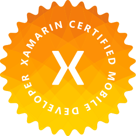

# Yauheni Pakala

Software Developer. Xamarin Certified Mobile Developer.

---

### I'm here

* [Tech Notes](https://wcoder.github.io/)
* [Habr](https://habrahabr.ru/users/wcoder/)
* [GitHub](https://github.com/wcoder/)
* [LinkedIn](https://www.linkedin.com/in/yauhenipakala/)
* [VK](https://vk.com/evgeniypakalo)
* [Twitter](https://twitter.com/evgeniypakalo)
* [Medium](https://medium.com/@wcoder)

### Published Packages

* [NPM](https://www.npmjs.com/~wcoder?activeTab=packages)
* [NuGet](https://www.nuget.org/profiles/wcoder)

### Store Apps

* [Microsoft Store](https://www.microsoft.com/en-us/store/search/apps?q=yauheni%20pakala)
* [Chrome Web Store](https://chrome.google.com/webstore/search/yauheni%20pakala)
* [Google Play](https://play.google.com/store/apps/developer?id=Yauheni+Pakala)

### Speaker

* 12/23/2017 - [IT-Shark Meetup #1](https://it-shark.pro/) - Terminal..VR
* 03/31/2018 - [IT-Shark Meetup #2](https://events.epam.com/events/it-shark-meetup/talks/5230) - Flutter.io
* 04/22/2018 - [Setcon Brest 2018](http://setcon.brest.tech/) - .NET Embedding

### Certifications

### Community Contributions

## &nbsp;

&copy; 2020

<!--

¯\_(ツ)_/¯

-->
